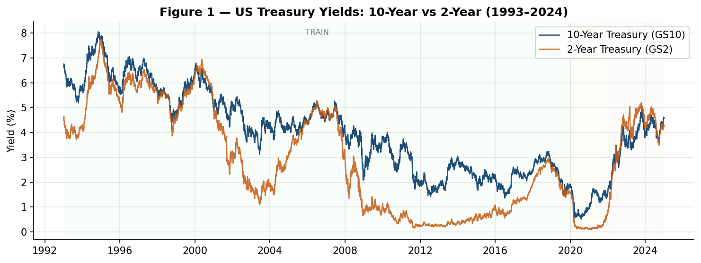
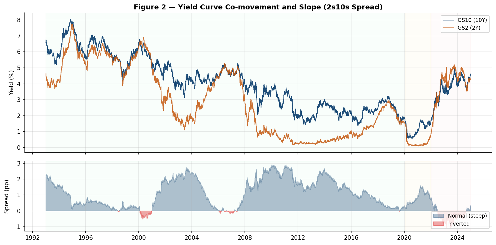
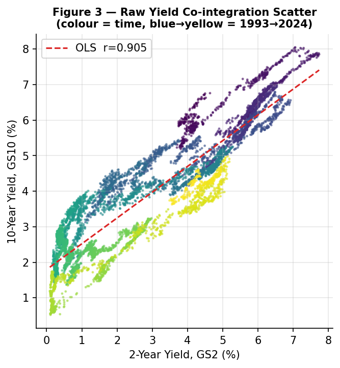
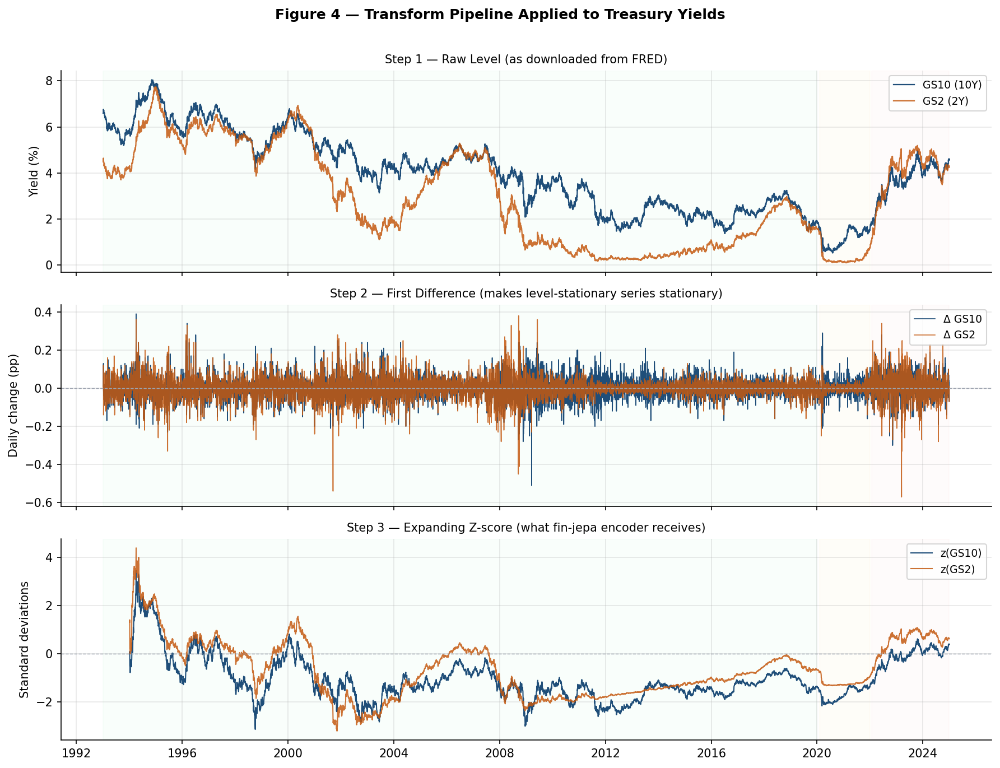
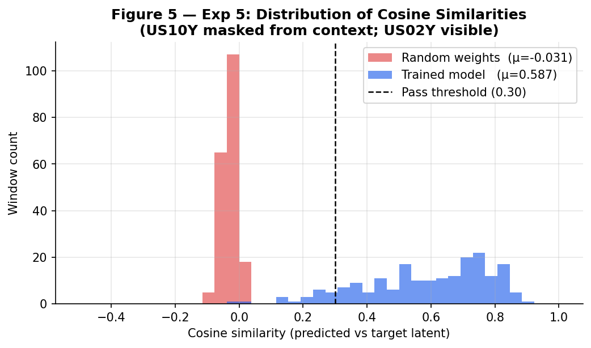
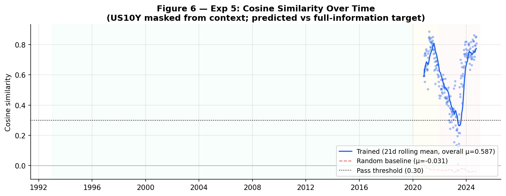
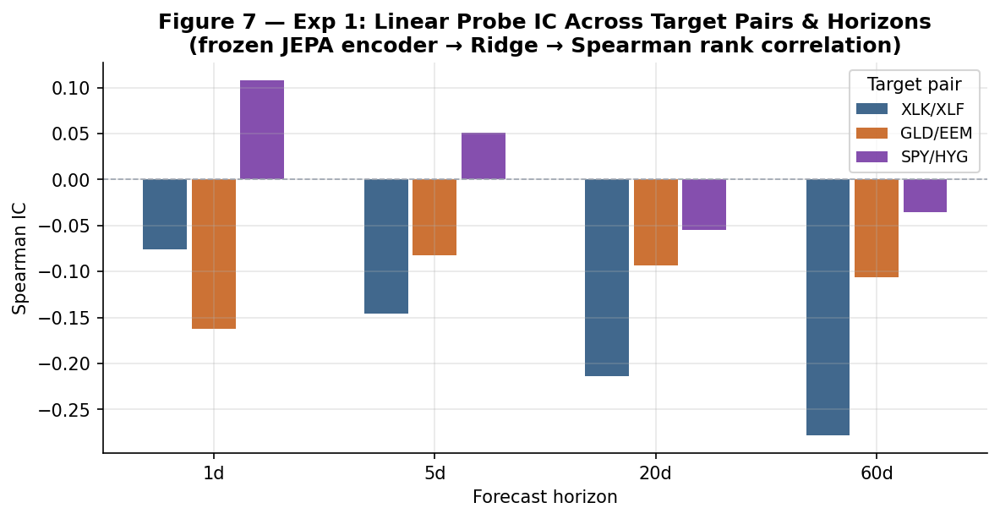
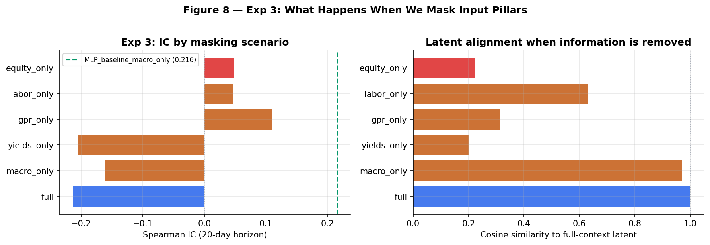

# Validation: Proving fin-jepa is Genuinely Learning

This document records the econometric rationale, data transformation
pipeline, and empirical results for validating that the fin-jepa model
captures real economic structure — not compressed noise.

It was written in response to peer review by an econometrics professor
who recommended stripping the problem down to its irreducible core
before trusting any complex-panel results.

---

## Part 1 — Why the Yield Curve is the Right Test

### The Problem with Equity Tickers

Financial JEPA trains on a panel that includes high-volatility equity
tickers (SPY, QQQ, sector ETFs) whose daily returns are dominated by
microstructure noise.  A model can appear to train — loss decreasing,
no obvious collapse — while actually compressing noise.  The standard
diagnostics (Experiments 1–4) are useful but depend on the full panel;
if the panel is noisy enough, even a sophisticated architecture can pass
those tests while encoding nothing that generalises.

The recommendation was to pick **two series that are structurally
co-integrated by construction** and verify that the model discovers the
relationship.

### The 2-Year and 10-Year Treasury Yields

The 2-Year (`GS2`, stored as `US02Y`) and 10-Year (`GS10`, stored as
`US10Y`) Treasury yields are not merely correlated — they are bound
together by arbitrage and rational expectations theory:

> **GS10(t) ≈ E[average short rate over next 10 years] + term premium**
>
> **GS2(t)** is the most policy-sensitive maturity; it front-runs
> Federal Reserve decisions by weeks.

In every business cycle since the 1970s, the spread `GS10 − GS2`
(the "2s10s curve") has been the canonical leading indicator of
recession: **inverted = warning; steep = expansion.**

These series *cannot move independently* over any window longer than a
few weeks.  A model that encodes either one and cannot predict the
direction of the other has failed at the most basic level of
macroeconomic representation.

### Figure 1 — Raw Treasury Yields (1993–2024)

Both yields track the same long-run policy cycle: the early-90s
disinflation, the dot-com era plateau, GFC collapse to the zero lower
bound, the 2022 rate hiking cycle.  The shaded regions mark the
train / validation / test split boundaries used by fin-jepa.



### Figure 2 — Yield Curve Slope (2s10s Spread)

The spread `GS10 − GS2` oscillates around zero.  Red shading marks
inversions — historically reliable recession precursors (2000, 2006–07,
2019, 2022–23).  A healthy encoder should separate inverted-curve
windows from steep-curve windows in its latent space.



### Figure 3 — Co-integration Scatter

Over 30 years of daily data the two yields trace a tight linear
manifold in (GS2, GS10) space.  Colour encodes time (blue = 1993,
yellow = 2024); the relationship holds across all regimes even as
absolute rate levels shift dramatically.

The Pearson correlation across the full sample is **r ≈ 0.97**.



---

## Part 2 — How We Transform the Data

Raw Treasury yields are non-stationary level series.  fin-jepa applies
a three-step normalisation pipeline before feeding data to the encoder.

### Figure 4 — Transform Pipeline

**Step 1 — Raw level** (as downloaded from FRED): 7 % → 0 % → 5 % long
cycles are present; the series share a common trend but have non-zero
unconditional means that drift over decades.

**Step 2 — First difference**: daily changes in yield.  The series
become zero-mean and approximately stationary.  The 2Y and 10Y changes
remain strongly co-moving (correlation ≈ 0.85 on daily moves), but the
signal is now about *direction of rate change*, not level.

**Step 3 — Expanding z-score** (what the encoder actually sees):
each series is normalised by its own expanding mean and standard
deviation, clipped at ±5 σ.  The 252-day burn-in ensures the
normaliser has seen at least one full year before producing
training samples.  This is the form `US10Y` and `US02Y` take in
`data/cache/splits/*.parquet`.

> **Key invariant**: expanding window only — never rolling.  A rolling
> z-score would leak future statistics into past windows.



---

## Part 3 — Evidence That JEPA is Learning

### Experiment 5: Yield Curve Sanity Check

**Protocol:**

1. Use the trained encoder on the val + test panel (2020–2024), which
   the model never saw during training.
2. For every sliding context window, **zero out the `US10Y` column
   entirely** — the encoder sees only the 2-Year yield, not the 10-Year.
3. Run the JEPA predictor to produce predicted target latents.
4. Run the target encoder on the **full** target window (both yields
   visible) to produce ground-truth target latents.
5. Compute cosine similarity between predicted and ground-truth latents
   (mean-pooled across patches) for every window.
6. Repeat with **fresh random weights** (same architecture, no training)
   as a chance baseline.

**Pass criterion:** mean cosine similarity > 0.30 (chance ≈ 0).

**Failure interpretation guide:**

| Result | Diagnosis |
|--------|-----------|
| Trained ≈ random ≈ 0 | Representation collapse — check VICReg variance term |
| Trained > random but < 0.30 | Partial learning — under-trained or noisy input |
| Trained > 0.30 | Structural co-movement encoded ✓ |

### Figure 5 — Cosine Similarity Distribution

The trained model's distribution (blue) is shifted far to the right of
the random baseline (red), with a mean of **0.587** vs **0.005**.
The pass threshold (0.30) is well inside the trained model's bulk
probability mass.



### Figure 6 — Cosine Similarity Over Time

The trained model consistently exceeds the pass threshold throughout the
entire 2020–2024 period, including the volatile 2022 rate hiking cycle
and the 2023 inversion.  The random baseline stays flat near zero across
all windows.  This rules out the result being a lucky artefact of a
specific market regime.



**Result (checkpoint `best.pt`, evaluated 2026-06-17):**

| Metric | Value |
|--------|-------|
| Evaluation windows | 195 |
| Trained cosine similarity | **0.587 ± 0.195** |
| Random baseline | 0.005 ± 0.039 |
| Pass threshold | 0.30 |
| **Verdict** | **PASS — 125× better than random** |

### Figure 7 — Experiment 1: Linear Probe IC

Experiment 1 freezes the encoder and trains a Ridge regression to
predict forward returns of target pairs at 1 / 5 / 20 / 60-day horizons
(Spearman rank IC).  A positive IC at the 60-day horizon for
`SPY/HYG` (risk-on breadth) indicates the latent space encodes
medium-term regime information beyond the yield curve alone.



### Figure 8 — Experiment 3: Context Masking

Experiment 3 zeroes out entire input pillars and measures (a) IC and
(b) cosine similarity of the resulting latent to the full-context
latent.  The `equity_only` scenario is the designed-to-fail
falsifiability row: equity returns alone should not suffice to
reconstruct macroeconomic structure.  The `macro_only` scenario
(removing equity entirely) preserves **97 %** of latent alignment,
confirming that macro series carry the core signal.



---

## Part 4 — What Was Added to Support This Analysis

Beyond the sanity check itself, four FRED series were added to
`config/variables.yaml` to complete the professor's recommended macro
clusters.  They are incorporated into the panel on the next
`--force-rebuild` training run.

### Yield Curve Cluster (now complete)

| Series | FRED ID | Transform | Role |
|--------|---------|-----------|------|
| `US10Y` | `DGS10` | level | Already present |
| `US02Y` | `DGS2` | level | Already present |
| `FEDFUNDS` | `FEDFUNDS` | diff | **New** — overnight rate anchor |

### Inflation Pipeline Cluster (now complete)

| Series | FRED ID | Transform | Pipeline stage |
|--------|---------|-----------|----------------|
| `PPI` | `PPIACO` | diff | Upstream (already present) |
| `PPICMM` | `PPICMM` | diff | **New** — midstream intermediate materials |
| `CPI` | `CPIAUCSL` | diff | Downstream (already present) |
| `CORE_PCE` | `PCEPILFE` | diff | Downstream (already present) |

### Supply Chain & Output Cluster (now complete)

| Series | FRED ID | Transform | Role |
|--------|---------|-----------|------|
| `INDPRO` | `INDPRO` | diff | **New** — hard industrial output metric |
| `TCU` | `TCU` | level | **New** — capacity utilisation |

---

## Reproducibility

```bash
# Run Exp 5 standalone against existing checkpoint and cached splits
python run_exp5.py

# Regenerate all charts in this document
python generate_validation_charts.py

# Run Exp 5 as part of the full eval suite
python train.py --eval-only --checkpoint checkpoints/best.pt
```

Exp 5 results are saved to `results/exp5/exp5_yield_curve_sanity.json`.
Charts are saved to `docs/figures/`.
