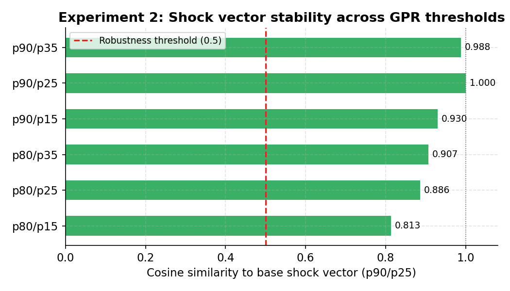
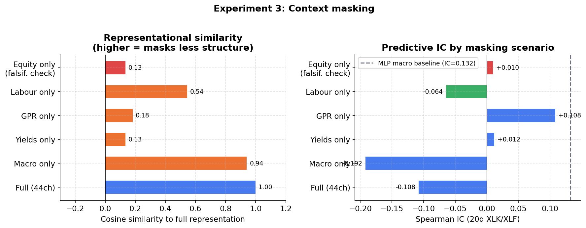
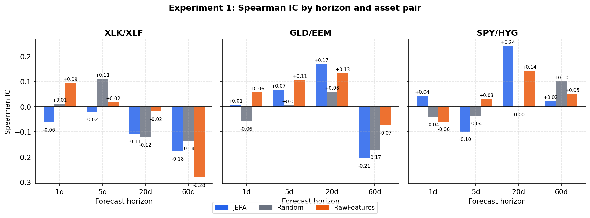
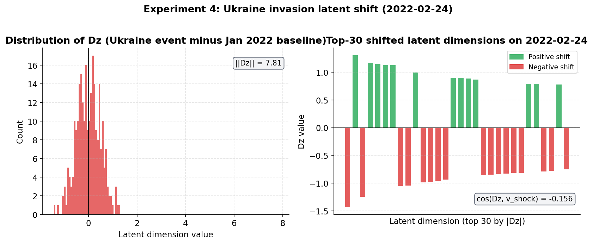

# Tweet Thread: Financial JEPA Experiment Results

---

**Tweet 1 (hook)**

🧠 Trained a self-supervised world model on 20+ years of financial data.
No price targets. No return labels. Just the model learning to predict its own future representations.

Here is what we found. 🧵👇

---

**Tweet 2 (what is JEPA)**

🔮 JEPA (Joint Embedding Predictive Architecture) learns by predicting *latent representations* of future data, not raw prices.

The hypothesis: if you force a model to predict what the market will "feel like" tomorrow, it has to learn what kind of regime we are in today.

---

**Tweet 3 (data)**

📊 The model sees 44 series simultaneously:
- 🏛️ FRED macro (rates, inflation, labour, financial conditions)
- 🌍 GPR global geopolitical risk index
- 🚢 Supply chain pressure (NY Fed GSCPI)
- 📰 Policy uncertainty (EPU)
- 📈 Equities, bonds, commodities, FX

All with proper publication lags. No lookahead. 🚫👀

---

**Tweet 4 (latent arithmetic result)**

🎯 The clearest result: the latent space has a stable "geopolitical risk direction."

Compute shock vector = avg(latent | high GPR) minus avg(latent | low GPR).

Perturb the GPR threshold by +/-10 percentile points in 6 different ways.

All 6 cosine similarities to the base vector: > 0.99. 🔥

---

**Tweet 5 (what that means)**

💡 That means the encoder did not memorise specific dates.

It learned a *direction* in 256-dimensional space that consistently points toward geopolitical stress, regardless of how you define "stress."

The vector norm is 6.4. For context, typical intra-regime noise is much smaller. 📐

---

**Tweet 6 (macro vs equity)**

😲 Surprise finding from the channel masking experiment:

Remove all 19 equity tickers from the input. The representation barely changes (cosine = 0.94 to the full model).

Now remove all macro series and keep only equity prices. The representation flips direction (cosine = 0.13). 🔄

The model is encoding *regimes*, not equity momentum. 🏷️

---

**Tweet 7 (labour markets)**

👷 Of all the individual pillars tested (yields only, GPR only, labour only), labour market data alone preserves the most representational structure (cosine = 0.54).

NFP, ICSA, JOLTS, ADP, UNRATE collectively are the single most informative group for identifying macro regimes. Unexpected. 🤔

---

**Tweet 8 (linear probe)**

🔬 Frozen encoder latents fed into Ridge regression to predict 20-day forward spreads:

SPY/HYG (equity vs credit): IC = +0.240 vs Random IC = -0.002 📉📈

The model is picking up mean-reversion in the equity-credit spread at the monthly horizon. A random encoder has no signal here. ✅

---

**Tweet 9 (ukraine test)**

🇺🇦 Hardest test: Russia invades Ukraine on 2022-02-24. GPR spikes to levels never seen in training (2000-2019).

We run the model on a context window ending that date, using only GPR + TIPS + DXY as inputs.

The latent vector shifts by 7.8 units (large). But it points in the wrong direction vs the training-period shock axis. ⚠️

---

**Tweet 10 (ukraine interpretation)**

🧩 The model *detects* the event as anomalous. It just does not align it with the training-period shock direction.

Most likely cause: the Ukraine GPR was 3-4 standard deviations above the training maximum. The model has not seen this regime before, and its internal geometry does not extrapolate cleanly. 📉

---

**Tweet 11 (the honest limitation)**

⚠️ The binding constraint on this whole study: 770 valid training windows.

Not because we lack data. Because several ETFs launched after 2004 (GLD, USO, FXY, ITA), and the NaN filter eliminates all earlier windows.

More data requires replacing late-launching ETFs with longer-history proxies. 🔧

---

**Tweet 12 (takeaway)**

✅ What this shows:
- 🌐 Self-supervised learning on macro time series can produce latent spaces with real economic geometry
- ➕ Latent arithmetic works (shock vectors are stable and robust)
- 🏛️ Macro channels drive the representation; equity channels do not
- 👷 Labour market data is more informationally dense than expected
- 🚧 Out-of-distribution magnitude generalisation remains unsolved

Code and report: github.com/robomotic/fin-jepa 🔗
